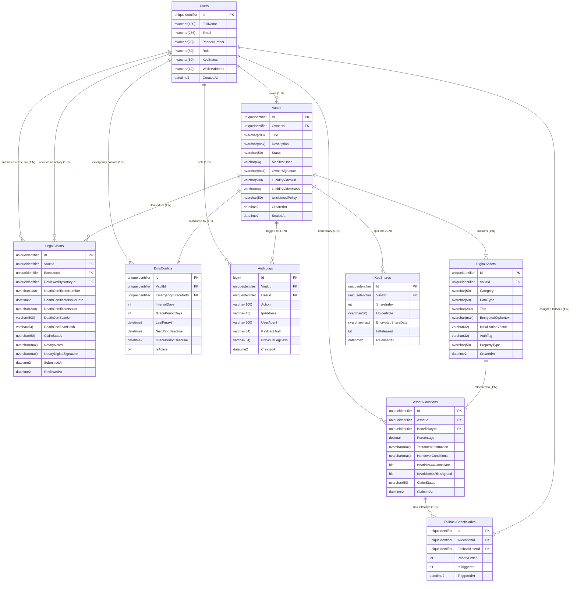

# THIẾT KẾ CƠ SỞ DỮ LIỆU & SƠ ĐỒ ERD
## DỰ ÁN: LEGACYVAULT — HỆ THỐNG QUẢN LÝ & BÀN GIAO DI SẢN SỐ
### CÔNG NGHỆ: SQL SERVER 2022 + ENTITY FRAMEWORK CORE 8 (.NET 8)

---

## 1. SƠ ĐỒ QUAN HỆ THỰC THỂ (MERMAID ERD)



---

## 2. CHI TIẾT TỪNG BẢNG (DATA DICTIONARY)

### 2.1. Bảng `Users` (Người dùng & Phân quyền)
Tích hợp cùng **ASP.NET Core Identity** (`AspNetUsers`).

| Cột | Kiểu dữ liệu | Nullable | Khóa | Ghi chú & Ràng buộc |
|---|---|---|---|---|
| `Id` | `UNIQUEIDENTIFIER` | NO | PK | GUID mặc định `NEWSEQUENTIALID()` |
| `FullName` | `NVARCHAR(100)` | NO | | Họ và tên người dùng |
| `Email` | `NVARCHAR(256)` | NO | UNIQUE | Email định danh đăng nhập |
| `PhoneNumber` | `NVARCHAR(20)` | YES | | Số điện thoại nhận OTP / SMS |
| `Role` | `NVARCHAR(50)` | NO | | `VaultOwner`, `DigitalExecutor`, `LegalVerifier`, `Beneficiary`, `Admin` |
| `KycStatus` | `NVARCHAR(50)` | NO | | `None`, `Pending`, `Verified`, `Rejected` (Mặc định: `None`) |
| `WalletAddress` | `NVARCHAR(42)` | YES | | Địa chỉ ví Web3 (Metamask EIP-4361) |
| `CreatedAt` | `DATETIME2` | NO | | Thời điểm tạo tài khoản (UTC) |
| `UpdatedAt` | `DATETIME2` | YES | | Thời điểm cập nhật cuối |

---

### 2.2. Bảng `Vaults` (Két sắt di sản số)

| Cột | Kiểu dữ liệu | Nullable | Khóa | Ghi chú & Ràng buộc |
|---|---|---|---|---|
| `Id` | `UNIQUEIDENTIFIER` | NO | PK | Khóa chính của Vault |
| `OwnerId` | `UNIQUEIDENTIFIER` | NO | FK | Khóa ngoại trỏ đến `Users.Id` |
| `Title` | `NVARCHAR(200)` | NO | | Tên gọi của két di sản (VD: Két gia tộc Berg) |
| `Description` | `NVARCHAR(MAX)` | YES | | Mô tả tổng quan về két sắt |
| `Status` | `NVARCHAR(50)` | NO | | 8 trạng thái: `ACTIVE`, `GRACE_PERIOD`, `AWAITING_LEGAL_PROOF`, `CLAIM_PENDING`, `APPROVED`, `REJECTED`, `CLOSED`, `FALLBACK_TRIGGERED`, `UNCLAIMED_LOCKED` |
| `ManifestHash` | `VARCHAR(64)` | YES | | Mã băm SHA-256 của toàn bộ danh mục tài sản + di chúc |
| `OwnerSignature` | `NVARCHAR(MAX)` | YES | | Chữ ký số ECDSA P-256 của Owner lên `ManifestHash` |
| `LucidityVideoUrl` | `VARCHAR(500)` | YES | | Link Cloudinary video minh mẫn 15s (Điều 630 BLDS) |
| `LucidityVideoHash` | `VARCHAR(64)` | YES | | SHA-256 của file video tuyên thệ |
| `UnclaimedPolicy` | `NVARCHAR(50)` | NO | | `ColdArchive` (Lưu trữ lạnh) hoặc `CryptographicBurn` (Tiêu hủy khóa Điều 38 BLDS) |
| `CreatedAt` | `DATETIME2` | NO | | Thời điểm khởi tạo kho |
| `SealedAt` | `DATETIME2` | YES | | Thời điểm ký số và niêm phong kho |

---

### 2.3. Bảng `DigitalAssets` (Tài sản số được mã hóa Client-Side E2EE)
*Tuân thủ nguyên tắc Zero-Knowledge: CSDL không lưu trữ mật khẩu / private key thô.*

| Cột | Kiểu dữ liệu | Nullable | Khóa | Ghi chú & Ràng buộc |
|---|---|---|---|---|
| `Id` | `UNIQUEIDENTIFIER` | NO | PK | Khóa chính của tài sản |
| `VaultId` | `UNIQUEIDENTIFIER` | NO | FK | Khóa ngoại trỏ đến `Vaults.Id` |
| `Category` | `NVARCHAR(50)` | NO | | `CryptoWallet`, `SocialAccount`, `IntellectualProperty`, `FinancialAccount`, `ConfidentialDocument` |
| `DataType` | `NVARCHAR(50)` | NO | | 3 nhóm: `EconomicEstate` (Di sản kinh tế), `DigitalMemento` (Kỷ vật), `ConfidentialPersonalData` (Bảo mật nhân thân) |
| `Title` | `NVARCHAR(200)` | NO | | Tên định danh tài sản (VD: Ví lạnh Bitcoin Ledger) |
| `EncryptedCiphertext`| `NVARCHAR(MAX)` | NO | | Dữ liệu nhạy cảm đã mã hóa bằng **AES-256-GCM** tại browser |
| `InitializationVector`| `VARCHAR(32)` | NO | | IV (12-16 bytes hex) dùng để giải mã AES-GCM |
| `AuthTag` | `VARCHAR(32)` | NO | | GCM Authentication Tag chống can thiệp bản mã |
| `PropertyType` | `NVARCHAR(50)` | NO | | `SoleProperty` (Tài sản riêng) hoặc `MaritalProperty` (Tài sản chung vợ chồng - khóa trần 50% theo Điều 612 BLDS) |
| `CreatedAt` | `DATETIME2` | NO | | Ngày tạo tài sản |

---

### 2.4. Bảng `AssetAllocations` (Phân bổ di sản & Lời dặn thừa kế)

| Cột | Kiểu dữ liệu | Nullable | Khóa | Ghi chú & Ràng buộc |
|---|---|---|---|---|
| `Id` | `UNIQUEIDENTIFIER` | NO | PK | Khóa chính phân bổ |
| `AssetId` | `UNIQUEIDENTIFIER` | NO | FK | Khóa ngoại trỏ đến `DigitalAssets.Id` |
| `BeneficiaryId` | `UNIQUEIDENTIFIER` | NO | FK | Người thụ hưởng (`Users.Id`) |
| `Percentage` | `DECIMAL(5, 2)` | NO | | Tỷ lệ hưởng (0.01% - 100.00%) |
| `TestamentInstruction`| `NVARCHAR(MAX)`| YES | | Lời dặn di chúc của thân chủ (font Lora Italic) |
| `HandoverConditions` | `NVARCHAR(MAX)`| YES | | Điều kiện nhận (VD: E-KYC + Zurich Notary Chamber) |
| `IsArticle644Compliant`| `BIT` | NO | | Đã rà soát thân nhân diện bắt buộc Điều 644 |
| `IsArticle644RiskAgreed`| `BIT` | NO | | Đã tích cam đoan tự chịu trách nhiệm rủi ro |
| `ClaimStatus` | `NVARCHAR(50)` | NO | | `Pending`, `Claimed`, `Rejected`, `Expired` |
| `ClaimedAt` | `DATETIME2` | YES | | Thời điểm Beneficiary giải mã và nhận bàn giao |

---

### 2.5. Bảng `FallbackBeneficiaries` (Người nhận dự phòng - Điều 622 BLDS)

| Cột | Kiểu dữ liệu | Nullable | Khóa | Ghi chú & Ràng buộc |
|---|---|---|---|---|
| `Id` | `UNIQUEIDENTIFIER` | NO | PK | Khóa chính |
| `AllocationId` | `UNIQUEIDENTIFIER` | NO | FK | Trỏ đến `AssetAllocations.Id` |
| `FallbackUserId` | `UNIQUEIDENTIFIER` | NO | FK | Người thụ hưởng dự phòng (`Users.Id`) |
| `PriorityOrder` | `INT` | NO | | Thứ tự ưu tiên (1: dự phòng 1, 2: dự phòng 2) |
| `IsTriggered` | `BIT` | NO | | Đã chuyển giao cho người dự phòng chưa |
| `TriggeredAt` | `DATETIME2` | YES | | Thời điểm kích hoạt chuyển giao dự phòng |

---

### 2.6. Bảng `DmsConfigs` (Cấu hình nhịp tim sinh tồn Dead Man's Switch)

| Cột | Kiểu dữ liệu | Nullable | Khóa | Ghi chú & Ràng buộc |
|---|---|---|---|---|
| `Id` | `UNIQUEIDENTIFIER` | NO | PK | Khóa chính |
| `VaultId` | `UNIQUEIDENTIFIER` | NO | FK | Khóa ngoại duy nhất trỏ đến `Vaults.Id` (1:1) |
| `EmergencyExecutorId`| `UNIQUEIDENTIFIER`| NO | FK | Digital Executor nhận cảnh báo (`Users.Id`) |
| `IntervalDays` | `INT` | NO | | Chu kỳ ping định kỳ (Thực tế: 30-90 ngày; Demo: 2 phút) |
| `GracePeriodDays` | `INT` | NO | | Thời gian ân hạn (Thực tế: 7-14 ngày; Demo: 1 phút) |
| `LastPingAt` | `DATETIME2` | NO | | Lần bấm 'Tôi còn hoạt động' gần nhất |
| `NextPingDeadline` | `DATETIME2` | NO | | Hạn chót = `LastPingAt + Interval` |
| `GracePeriodDeadline`| `DATETIME2` | YES | | Hạn chót ân hạn trước khi chuyển `AWAITING_LEGAL_PROOF` |
| `IsActive` | `BIT` | NO | | DMS đang bật hay tắt (Mặc định: 1) |

---

### 2.7. Bảng `LegalClaims` (Hồ sơ yêu cầu thừa kế & Thẩm định Giấy chứng tử)

| Cột | Kiểu dữ liệu | Nullable | Khóa | Ghi chú & Ràng buộc |
|---|---|---|---|---|
| `Id` | `UNIQUEIDENTIFIER` | NO | PK | Khóa chính của hồ sơ Claim |
| `VaultId` | `UNIQUEIDENTIFIER` | NO | FK | Két sắt cần mở thừa kế (`Vaults.Id`) |
| `ExecutorId` | `UNIQUEIDENTIFIER` | NO | FK | Digital Executor nộp đơn (`Users.Id`) |
| `ReviewedByNotaryId` | `UNIQUEIDENTIFIER` | YES | FK | Công chứng viên thẩm định (`Users.Id`) |
| `DeathCertificateNumber`| `NVARCHAR(100)`| NO | | Số hiệu Giấy chứng tử / Trích lục khai tử |
| `DeathCertificateIssueDate`| `DATETIME2` | NO | | Ngày cấp ghi trên giấy |
| `DeathCertificateIssuer`| `NVARCHAR(200)`| NO | | Cơ quan cấp (VD: UBND Phường Bến Nghé, Q1) |
| `DeathCertScanUrl` | `VARCHAR(500)` | NO | | Link file scan trên Cloudinary |
| `DeathCertScanHash` | `VARCHAR(64)` | NO | | Mã băm SHA-256 của file scan |
| `ClaimStatus` | `NVARCHAR(50)` | NO | | `Submitted`, `UnderReview`, `Approved`, `Rejected` |
| `NotaryNotes` | `NVARCHAR(MAX)` | YES | | Ý kiến thẩm định hoặc lý do từ chối |
| `NotaryDigitalSignature`| `NVARCHAR(MAX)`| YES | | Chữ ký số của Công chứng viên khi bấm Phê duyệt |
| `SubmittedAt` | `DATETIME2` | NO | | Ngày Executor nộp đơn |
| `ReviewedAt` | `DATETIME2` | YES | | Ngày Công chứng viên ra quyết định |

---

### 2.8. Bảng `KeyShares` (Mảnh khóa bí mật Shamir Secret Sharing - Ngưỡng 2/3)

| Cột | Kiểu dữ liệu | Nullable | Khóa | Ghi chú & Ràng buộc |
|---|---|---|---|---|
| `Id` | `UNIQUEIDENTIFIER` | NO | PK | Khóa chính |
| `VaultId` | `UNIQUEIDENTIFIER` | NO | FK | Trỏ đến `Vaults.Id` |
| `ShareIndex` | `INT` | NO | | 1: System Share, 2: Notary Share, 3: Beneficiary Share |
| `HolderRole` | `NVARCHAR(50)` | NO | | `System`, `Notary`, `Beneficiary` |
| `EncryptedShareData`| `NVARCHAR(MAX)`| NO | | Dữ liệu mảnh khóa đã mã hóa |
| `IsReleased` | `BIT` | NO | | Chỉ mở khóa khi Notary đã phê duyệt hợp lệ (1) |
| `ReleasedAt` | `DATETIME2` | YES | | Thời điểm giải phóng mảnh khóa |

---

### 2.9. Bảng `AuditLogs` (Sổ cái kiểm toán WORM - Write Once Read Many)

| Cột | Kiểu dữ liệu | Nullable | Khóa | Ghi chú & Ràng buộc |
|---|---|---|---|---|
| `Id` | `BIGINT IDENTITY` | NO | PK | Khóa chính tự tăng |
| `VaultId` | `UNIQUEIDENTIFIER` | YES | FK | Két sắt liên quan |
| `UserId` | `UNIQUEIDENTIFIER` | YES | FK | Tác nhân thực hiện |
| `Action` | `VARCHAR(100)` | NO | | `VAULT_CREATED`, `PING_HEARTBEAT`, `GRACE_TRIGGERED`, `CLAIM_SUBMITTED`, `NOTARY_APPROVED`, `ASSET_DECRYPTED`... |
| `IpAddress` | `VARCHAR(45)` | YES | | Địa chỉ IP của client |
| `UserAgent` | `VARCHAR(500)` | YES | | Trình duyệt và thiết bị |
| `PayloadHash` | `VARCHAR(64)` | NO | | Mã băm SHA-256 của nội dung thao tác |
| `PreviousLogHash` | `VARCHAR(64)` | NO | | Hash của bản ghi trước đó (chuỗi liên kết chống sửa đổi) |
| `CreatedAt` | `DATETIME2` | NO | | Thời điểm ghi nhận (UTC) |

---

## 3. T-SQL SCRIPT KHỞI TẠO CƠ SỞ DỮ LIỆU (SQL SERVER)

```sql
-- ====================================================================
-- DATABASE SCRIPT: LEGACYVAULT (SWP391 FPT UNIVERSITY)
-- Author: Nguyen Hai Duong (SE203568) - BE Lead
-- ====================================================================

CREATE DATABASE LegacyVaultDb;
GO

USE LegacyVaultDb;
GO

-- 1. Table: Users
CREATE TABLE Users (
    Id UNIQUEIDENTIFIER PRIMARY KEY DEFAULT NEWSEQUENTIALID(),
    FullName NVARCHAR(100) NOT NULL,
    Email NVARCHAR(256) NOT NULL UNIQUE,
    PhoneNumber NVARCHAR(20) NULL,
    Role NVARCHAR(50) NOT NULL,
    KycStatus NVARCHAR(50) NOT NULL DEFAULT 'None',
    WalletAddress NVARCHAR(42) NULL,
    CreatedAt DATETIME2 NOT NULL DEFAULT SYSUTCDATETIME(),
    UpdatedAt DATETIME2 NULL
);
CREATE INDEX IX_Users_Email ON Users(Email);
CREATE INDEX IX_Users_Role ON Users(Role);

-- 2. Table: Vaults
CREATE TABLE Vaults (
    Id UNIQUEIDENTIFIER PRIMARY KEY DEFAULT NEWSEQUENTIALID(),
    OwnerId UNIQUEIDENTIFIER NOT NULL,
    Title NVARCHAR(200) NOT NULL,
    Description NVARCHAR(MAX) NULL,
    Status NVARCHAR(50) NOT NULL DEFAULT 'ACTIVE',
    ManifestHash VARCHAR(64) NULL,
    OwnerSignature NVARCHAR(MAX) NULL,
    LucidityVideoUrl VARCHAR(500) NULL,
    LucidityVideoHash VARCHAR(64) NULL,
    UnclaimedPolicy NVARCHAR(50) NOT NULL DEFAULT 'ColdArchive',
    CreatedAt DATETIME2 NOT NULL DEFAULT SYSUTCDATETIME(),
    SealedAt DATETIME2 NULL,
    CONSTRAINT FK_Vaults_Users FOREIGN KEY (OwnerId) REFERENCES Users(Id)
);
CREATE INDEX IX_Vaults_OwnerId ON Vaults(OwnerId);
CREATE INDEX IX_Vaults_Status ON Vaults(Status);

-- 3. Table: DigitalAssets
CREATE TABLE DigitalAssets (
    Id UNIQUEIDENTIFIER PRIMARY KEY DEFAULT NEWSEQUENTIALID(),
    VaultId UNIQUEIDENTIFIER NOT NULL,
    Category NVARCHAR(50) NOT NULL,
    DataType NVARCHAR(50) NOT NULL,
    Title NVARCHAR(200) NOT NULL,
    EncryptedCiphertext NVARCHAR(MAX) NOT NULL,
    InitializationVector VARCHAR(32) NOT NULL,
    AuthTag VARCHAR(32) NOT NULL,
    PropertyType NVARCHAR(50) NOT NULL DEFAULT 'SoleProperty',
    CreatedAt DATETIME2 NOT NULL DEFAULT SYSUTCDATETIME(),
    CONSTRAINT FK_DigitalAssets_Vaults FOREIGN KEY (VaultId) REFERENCES Vaults(Id) ON DELETE CASCADE
);
CREATE INDEX IX_DigitalAssets_VaultId ON DigitalAssets(VaultId);

-- 4. Table: AssetAllocations
CREATE TABLE AssetAllocations (
    Id UNIQUEIDENTIFIER PRIMARY KEY DEFAULT NEWSEQUENTIALID(),
    AssetId UNIQUEIDENTIFIER NOT NULL,
    BeneficiaryId UNIQUEIDENTIFIER NOT NULL,
    Percentage DECIMAL(5, 2) NOT NULL,
    TestamentInstruction NVARCHAR(MAX) NULL,
    HandoverConditions NVARCHAR(MAX) NULL,
    IsArticle644Compliant BIT NOT NULL DEFAULT 1,
    IsArticle644RiskAgreed BIT NOT NULL DEFAULT 0,
    ClaimStatus NVARCHAR(50) NOT NULL DEFAULT 'Pending',
    ClaimedAt DATETIME2 NULL,
    CONSTRAINT FK_AssetAllocations_Assets FOREIGN KEY (AssetId) REFERENCES DigitalAssets(Id) ON DELETE CASCADE,
    CONSTRAINT FK_AssetAllocations_Users FOREIGN KEY (BeneficiaryId) REFERENCES Users(Id)
);
CREATE INDEX IX_AssetAllocations_BeneficiaryId ON AssetAllocations(BeneficiaryId);

-- 5. Table: FallbackBeneficiaries
CREATE TABLE FallbackBeneficiaries (
    Id UNIQUEIDENTIFIER PRIMARY KEY DEFAULT NEWSEQUENTIALID(),
    AllocationId UNIQUEIDENTIFIER NOT NULL,
    FallbackUserId UNIQUEIDENTIFIER NOT NULL,
    PriorityOrder INT NOT NULL DEFAULT 1,
    IsTriggered BIT NOT NULL DEFAULT 0,
    TriggeredAt DATETIME2 NULL,
    CONSTRAINT FK_Fallback_Allocation FOREIGN KEY (AllocationId) REFERENCES AssetAllocations(Id) ON DELETE CASCADE,
    CONSTRAINT FK_Fallback_Users FOREIGN KEY (FallbackUserId) REFERENCES Users(Id)
);

-- 6. Table: DmsConfigs
CREATE TABLE DmsConfigs (
    Id UNIQUEIDENTIFIER PRIMARY KEY DEFAULT NEWSEQUENTIALID(),
    VaultId UNIQUEIDENTIFIER NOT NULL UNIQUE,
    EmergencyExecutorId UNIQUEIDENTIFIER NOT NULL,
    IntervalDays INT NOT NULL DEFAULT 30,
    GracePeriodDays INT NOT NULL DEFAULT 7,
    LastPingAt DATETIME2 NOT NULL DEFAULT SYSUTCDATETIME(),
    NextPingDeadline DATETIME2 NOT NULL,
    GracePeriodDeadline DATETIME2 NULL,
    IsActive BIT NOT NULL DEFAULT 1,
    CONSTRAINT FK_DmsConfigs_Vaults FOREIGN KEY (VaultId) REFERENCES Vaults(Id) ON DELETE CASCADE,
    CONSTRAINT FK_DmsConfigs_Users FOREIGN KEY (EmergencyExecutorId) REFERENCES Users(Id)
);
CREATE INDEX IX_DmsConfigs_NextPingDeadline ON DmsConfigs(NextPingDeadline) WHERE IsActive = 1;

-- 7. Table: LegalClaims
CREATE TABLE LegalClaims (
    Id UNIQUEIDENTIFIER PRIMARY KEY DEFAULT NEWSEQUENTIALID(),
    VaultId UNIQUEIDENTIFIER NOT NULL,
    ExecutorId UNIQUEIDENTIFIER NOT NULL,
    ReviewedByNotaryId UNIQUEIDENTIFIER NULL,
    DeathCertificateNumber NVARCHAR(100) NOT NULL,
    DeathCertificateIssueDate DATETIME2 NOT NULL,
    DeathCertificateIssuer NVARCHAR(200) NOT NULL,
    DeathCertScanUrl VARCHAR(500) NOT NULL,
    DeathCertScanHash VARCHAR(64) NOT NULL,
    ClaimStatus NVARCHAR(50) NOT NULL DEFAULT 'Submitted',
    NotaryNotes NVARCHAR(MAX) NULL,
    NotaryDigitalSignature NVARCHAR(MAX) NULL,
    SubmittedAt DATETIME2 NOT NULL DEFAULT SYSUTCDATETIME(),
    ReviewedAt DATETIME2 NULL,
    CONSTRAINT FK_LegalClaims_Vaults FOREIGN KEY (VaultId) REFERENCES Vaults(Id),
    CONSTRAINT FK_LegalClaims_Executor FOREIGN KEY (ExecutorId) REFERENCES Users(Id),
    CONSTRAINT FK_LegalClaims_Notary FOREIGN KEY (ReviewedByNotaryId) REFERENCES Users(Id)
);
CREATE INDEX IX_LegalClaims_VaultId ON LegalClaims(VaultId);
CREATE INDEX IX_LegalClaims_ClaimStatus ON LegalClaims(ClaimStatus);

-- 8. Table: KeyShares
CREATE TABLE KeyShares (
    Id UNIQUEIDENTIFIER PRIMARY KEY DEFAULT NEWSEQUENTIALID(),
    VaultId UNIQUEIDENTIFIER NOT NULL,
    ShareIndex INT NOT NULL,
    HolderRole NVARCHAR(50) NOT NULL,
    EncryptedShareData NVARCHAR(MAX) NOT NULL,
    IsReleased BIT NOT NULL DEFAULT 0,
    ReleasedAt DATETIME2 NULL,
    CONSTRAINT FK_KeyShares_Vaults FOREIGN KEY (VaultId) REFERENCES Vaults(Id) ON DELETE CASCADE
);
CREATE INDEX IX_KeyShares_VaultId ON KeyShares(VaultId);

-- 9. Table: AuditLogs (WORM)
CREATE TABLE AuditLogs (
    Id BIGINT IDENTITY(1,1) PRIMARY KEY,
    VaultId UNIQUEIDENTIFIER NULL,
    UserId UNIQUEIDENTIFIER NULL,
    Action VARCHAR(100) NOT NULL,
    IpAddress VARCHAR(45) NULL,
    UserAgent VARCHAR(500) NULL,
    PayloadHash VARCHAR(64) NOT NULL,
    PreviousLogHash VARCHAR(64) NOT NULL,
    CreatedAt DATETIME2 NOT NULL DEFAULT SYSUTCDATETIME(),
    CONSTRAINT FK_AuditLogs_Vaults FOREIGN KEY (VaultId) REFERENCES Vaults(Id),
    CONSTRAINT FK_AuditLogs_Users FOREIGN KEY (UserId) REFERENCES Users(Id)
);
CREATE INDEX IX_AuditLogs_VaultId ON AuditLogs(VaultId);
CREATE INDEX IX_AuditLogs_CreatedAt ON AuditLogs(CreatedAt);
GO
```
