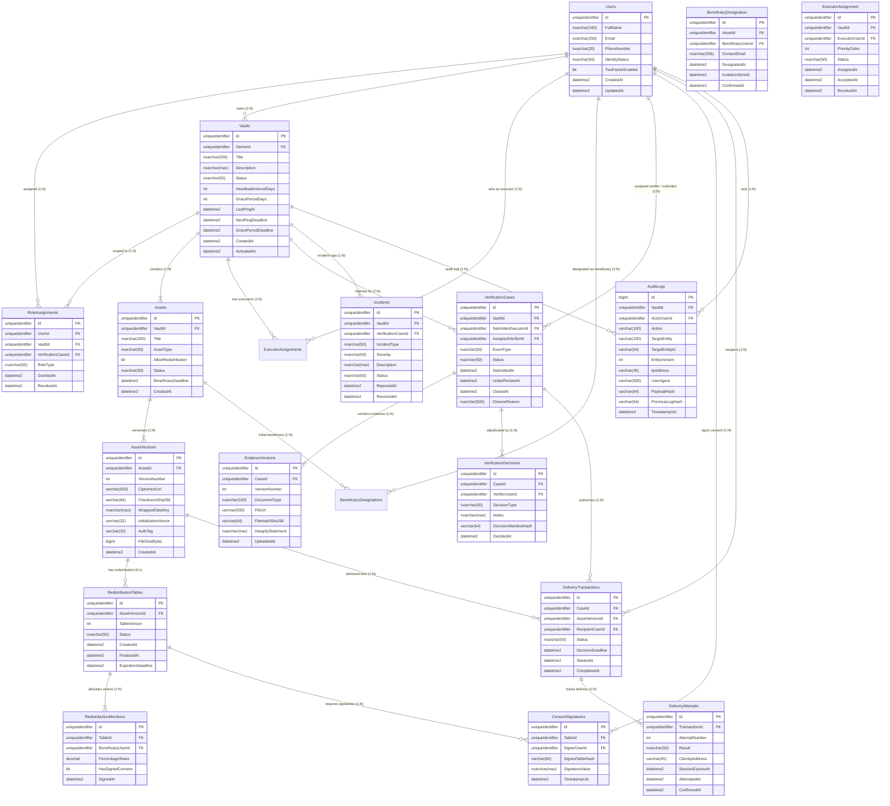

# THIẾT KẾ CƠ SỞ DỮ LIỆU & SƠ ĐỒ ERD (DATABASE SCHEMA & ERD)

## DỰ ÁN: LEGACYVAULT — HỆ THỐNG LƯU GIỮ VÀ BÀN GIAO TÀI SẢN SỐ
### Phiên bản: 1.1 — Chuẩn hóa theo SRS v1.1 (19/09/2026)
### Công nghệ: SQL Server 2022 + Entity Framework Core 8 (.NET 8)

---

## 1. SƠ ĐỒ QUAN HỆ THỰC THỂ (MERMAID ERD — 16 THỰC THỂ CỐT LÕI)

---

## 2. DATA DICTIONARY CHI TIẾT (16 THỰC THỂ)

### 2.1. Bảng `Users` (Người dùng & Định danh)
| Cột | Kiểu dữ liệu | Nullable | Khóa | Mô tả & Ràng buộc |
| :--- | :--- | :--- | :--- | :--- |
| `Id` | `UNIQUEIDENTIFIER` | NO | PK | Mặc định `NEWSEQUENTIALID()` |
| `FullName` | `NVARCHAR(100)` | NO | | Họ và tên |
| `Email` | `NVARCHAR(256)` | NO | UNIQUE | Email đăng nhập, chỉ mục Index |
| `PhoneNumber` | `NVARCHAR(20)` | YES | | Số điện thoại nhận OTP / Thông báo |
| `IdentityStatus` | `NVARCHAR(50)` | NO | | `UNVERIFIED`, `PENDING`, `VERIFIED`, `REJECTED` |
| `TwoFactorEnabled` | `BIT` | NO | | Bắt buộc `1` để kích hoạt kho (BR-01) |
| `CreatedAt` | `DATETIME2` | NO | | Thời điểm tạo tài khoản (UTC) |
| `UpdatedAt` | `DATETIME2` | YES | | Thời điểm cập nhật hồ sơ |

### 2.2. Bảng `RoleAssignments` (Phân quyền theo ngữ cảnh Kho / Hồ sơ)
*Nguyên tắc:* Không dùng một vai trò toàn cục duy nhất. Người thực hiện hoặc người xác minh của hồ sơ không đồng thời là người thụ hưởng trong cùng hồ sơ (BR-05).
| Cột | Kiểu dữ liệu | Nullable | Khóa | Mô tả & Ràng buộc |
| :--- | :--- | :--- | :--- | :--- |
| `Id` | `UNIQUEIDENTIFIER` | NO | PK | GUID |
| `UserId` | `UNIQUEIDENTIFIER` | NO | FK | Khóa ngoại tới `Users` |
| `VaultId` | `UNIQUEIDENTIFIER` | YES | FK | Khóa ngoại tới `Vaults` (khi gán quyền kho) |
| `VerificationCaseId` | `UNIQUEIDENTIFIER` | YES | FK | Khóa ngoại tới `VerificationCases` (khi gán quyền hồ sơ) |
| `RoleType` | `NVARCHAR(50)` | NO | | `VAULT_OWNER`, `DIGITAL_EXECUTOR`, `LEGAL_VERIFIER`, `BENEFICIARY`, `SYSTEM_ADMIN` |
| `GrantedAt` | `DATETIME2` | NO | | Thời điểm cấp quyền (UTC) |
| `RevokedAt` | `DATETIME2` | YES | | Thời điểm thu hồi quyền (UTC) |

### 2.3. Bảng `Vaults` (Kho tài sản số & Cấu hình điểm danh)
| Cột | Kiểu dữ liệu | Nullable | Khóa | Mô tả & Ràng buộc |
| :--- | :--- | :--- | :--- | :--- |
| `Id` | `UNIQUEIDENTIFIER` | NO | PK | GUID |
| `OwnerId` | `UNIQUEIDENTIFIER` | NO | FK | Chủ sở hữu kho (`Users`) |
| `Title` | `NVARCHAR(200)` | NO | | Tiêu đề kho |
| `Description` | `NVARCHAR(MAX)` | YES | | Ghi chú di nguyện |
| `Status` | `NVARCHAR(50)` | NO | | `DRAFT`, `ACTIVE`, `OVERDUE`, `VERIFICATION_PENDING`, `READY_FOR_HANDOVER`, `PARTIALLY_DELIVERED`, `COMPLETED`, `FROZEN` |
| `HeartbeatIntervalDays`| `INT` | NO | | Chu kỳ điểm danh (mặc định 30 - 180 ngày) |
| `GracePeriodDays` | `INT` | NO | | Thời gian ân hạn chờ phản hồi (mặc định 7 - 14 ngày) |
| `LastPingAt` | `DATETIME2` | YES | | Thời điểm điểm danh thành công gần nhất |
| `NextPingDeadline` | `DATETIME2` | YES | | Hạn điểm danh tiếp theo |
| `GracePeriodDeadline`| `DATETIME2` | YES | | Hạn chót trước khi chuyển `VERIFICATION_PENDING` |
| `CreatedAt` | `DATETIME2` | NO | | Ngày tạo |
| `ActivatedAt` | `DATETIME2` | YES | | Ngày kích hoạt kho (chuyển `ACTIVE` khi đủ BR-01) |

### 2.4. Bảng `Assets` (Tài sản số logic)
| Cột | Kiểu dữ liệu | Nullable | Khóa | Mô tả & Ràng buộc |
| :--- | :--- | :--- | :--- | :--- |
| `Id` | `UNIQUEIDENTIFIER` | NO | PK | GUID |
| `VaultId` | `UNIQUEIDENTIFIER` | NO | FK | Khóa ngoại tới `Vaults` |
| `Title` | `NVARCHAR(200)` | NO | | Tên gọi gợi nhớ của tài sản |
| `AssetType` | `NVARCHAR(50)` | NO | | `DOCUMENT`, `CREDENTIAL`, `CRYPTO_SEED`, `FINANCIAL_NOTE` |
| `AllowRedistribution` | `BIT` | NO | | `1`: Cho phép người nhận ban đầu chia sẻ lại 1 lần duy nhất |
| `Status` | `NVARCHAR(50)` | NO | | `ACTIVE`, `UNASSIGNED_PENDING`, `FROZEN`, `DELIVERED`, `DELETED` |
| `BeneficiaryDeadline` | `DATETIME2` | YES | | Hạn 1 tháng để bổ sung người nhận; hết hạn đóng băng riêng tệp (BR-03) |
| `CreatedAt` | `DATETIME2` | NO | | Ngày tạo |

### 2.5. Bảng `AssetVersions` (Phiên bản tệp mã hóa & Khóa dữ liệu bao bọc)
*Bảo mật SEC-01:* Mỗi phiên bản tệp dùng một khóa dữ liệu ngẫu nhiên riêng (AES-256-GCM). Khóa dữ liệu được bao bọc (Wrapped) qua dịch vụ KMS tin cậy.
| Cột | Kiểu dữ liệu | Nullable | Khóa | Mô tả & Ràng buộc |
| :--- | :--- | :--- | :--- | :--- |
| `Id` | `UNIQUEIDENTIFIER` | NO | PK | GUID |
| `AssetId` | `UNIQUEIDENTIFIER` | NO | FK | Khóa ngoại tới `Assets` |
| `VersionNumber` | `INT` | NO | | Phiên bản (1, 2, 3...) tăng tuần tự khi sửa (BR-09) |
| `CiphertextUrl` | `VARCHAR(500)` | NO | | Đường dẫn lưu bản mã (Cloudflare R2 / S3) |
| `ChecksumSha256` | `VARCHAR(64)` | NO | | Băm SHA-256 kiểm tra tính toàn vẹn bản mã |
| `WrappedDataKey` | `NVARCHAR(MAX)` | NO | | Khóa dữ liệu AES-256 đã bọc bảo vệ bằng dịch vụ tin cậy |
| `InitializationVector`| `VARCHAR(32)` | NO | | IV ngẫu nhiên 12 bytes mã hóa Base64 |
| `AuthTag` | `VARCHAR(32)` | NO | | Authentication Tag 16 bytes GCM |
| `FileSizeBytes` | `BIGINT` | NO | | Kích thước file mã hóa (tối đa 50MB theo NFR-02) |
| `CreatedAt` | `DATETIME2` | NO | | Thời điểm tạo phiên bản |

### 2.6. Bảng `BeneficiaryDesignation` (Chỉ định người nhận ban đầu)
*Quy tắc BR-04:* Mỗi tệp có một người nhận ban đầu do chủ sở hữu chỉ định.
| Cột | Kiểu dữ liệu | Nullable | Khóa | Mô tả & Ràng buộc |
| :--- | :--- | :--- | :--- | :--- |
| `Id` | `UNIQUEIDENTIFIER` | NO | PK | GUID |
| `AssetId` | `UNIQUEIDENTIFIER` | NO | FK | Khóa ngoại tới `Assets` |
| `BeneficiaryUserId` | `UNIQUEIDENTIFIER` | YES | FK | Khóa ngoại tới `Users` nếu đã có tài khoản |
| `ContactEmail` | `NVARCHAR(256)` | NO | | Email liên hệ nhận lời mời |
| `DesignatedAt` | `DATETIME2` | NO | | Thời điểm chỉ định |
| `InvitationSentAt` | `DATETIME2` | YES | | Thời điểm gửi lời mời đầu tiên |
| `ConfirmedAt` | `DATETIME2` | YES | | Thời điểm người nhận xác nhận danh tính |

### 2.7. Bảng `ExecutorAssignment` (Phân công người thực hiện & Danh sách dự phòng)
*Quy tắc ASSIGN:* Danh sách dự phòng do chủ sở hữu lập theo thứ tự ưu tiên (`PriorityOrder`).
| Cột | Kiểu dữ liệu | Nullable | Khóa | Mô tả & Ràng buộc |
| :--- | :--- | :--- | :--- | :--- |
| `Id` | `UNIQUEIDENTIFIER` | NO | PK | GUID |
| `VaultId` | `UNIQUEIDENTIFIER` | NO | FK | Khóa ngoại tới `Vaults` |
| `ExecutorUserId` | `UNIQUEIDENTIFIER` | NO | FK | Người dùng được phân công (`Users`) |
| `PriorityOrder` | `INT` | NO | | `1`: Chính; `2, 3...`: Dự phòng theo thứ tự |
| `Status` | `NVARCHAR(50)` | NO | | `INVITED`, `ACCEPTED`, `ACTIVE`, `DECLINED`, `REVOKED` |
| `AssignedAt` | `DATETIME2` | NO | | Thời điểm phân công |
| `AcceptedAt` | `DATETIME2` | YES | | Thời điểm chấp nhận vai trò |
| `RevokedAt` | `DATETIME2` | YES | | Thời điểm thu hồi |

### 2.8. Bảng `VerificationCases` (Hồ sơ sự kiện tử tuất / mất tích)
| Cột | Kiểu dữ liệu | Nullable | Khóa | Mô tả & Ràng buộc |
| :--- | :--- | :--- | :--- | :--- |
| `Id` | `UNIQUEIDENTIFIER` | NO | PK | GUID |
| `VaultId` | `UNIQUEIDENTIFIER` | NO | FK | Khóa ngoại tới `Vaults` |
| `SubmitterExecutorId`| `UNIQUEIDENTIFIER` | NO | FK | Người nộp hồ sơ (`Users`) |
| `AssignedVerifierId` | `UNIQUEIDENTIFIER` | YES | FK | Người xác minh pháp lý đang thụ lý (`Users`) |
| `EventType` | `NVARCHAR(50)` | NO | | `DECEASED`, `MISSING` (mất tích không tự tạo quyền nhận) |
| `Status` | `NVARCHAR(50)` | NO | | `SUBMITTED`, `UNDER_REVIEW`, `NEEDS_EVIDENCE`, `MISSING_PENDING`, `APPROVED`, `REJECTED`, `FRAUDULENT`, `PAUSED`, `RE_VERIFIED`, `CANCELLED`, `CLOSED` |
| `SubmittedAt` | `DATETIME2` | NO | | Ngày nộp hồ sơ |
| `UnderReviewAt` | `DATETIME2` | YES | | Ngày bắt đầu xem xét |
| `ClosedAt` | `DATETIME2` | YES | | Ngày đóng hồ sơ |
| `ClosureReason` | `NVARCHAR(500)` | YES | | Lý do đóng (VD: `CLOSE-05: Hủy vì chủ sở hữu còn sống`) |

### 2.9. Bảng `EvidenceVersions` (Giấy tờ chứng minh bất biến theo phiên bản)
| Cột | Kiểu dữ liệu | Nullable | Khóa | Mô tả & Ràng buộc |
| :--- | :--- | :--- | :--- | :--- |
| `Id` | `UNIQUEIDENTIFIER` | NO | PK | GUID |
| `CaseId` | `UNIQUEIDENTIFIER` | NO | FK | Khóa ngoại tới `VerificationCases` |
| `VersionNumber` | `INT` | NO | | Phiên bản hồ sơ nộp/bổ sung (1, 2...) |
| `DocumentType` | `NVARCHAR(100)` | NO | | `DEATH_CERTIFICATE`, `POLICE_REPORT`, `COMMITMENT_LETTER` |
| `FileUrl` | `VARCHAR(500)` | NO | | Đường dẫn lưu scan giấy tờ |
| `FileHashSha256` | `VARCHAR(64)` | NO | | Băm SHA-256 đối soát toàn vẹn |
| `IntegrityStatement` | `NVARCHAR(MAX)` | YES | | Bản cam kết tính trung thực được Executor ký |
| `UploadedAt` | `DATETIME2` | NO | | Thời điểm tải lên |

### 2.10. Bảng `VerificationDecisions` (Quyết định thẩm định của Người xác minh)
| Cột | Kiểu dữ liệu | Nullable | Khóa | Mô tả & Ràng buộc |
| :--- | :--- | :--- | :--- | :--- |
| `Id` | `UNIQUEIDENTIFIER` | NO | PK | GUID |
| `CaseId` | `UNIQUEIDENTIFIER` | NO | FK | Khóa ngoại tới `VerificationCases` |
| `VerifierUserId` | `UNIQUEIDENTIFIER` | NO | FK | Người xác minh ra quyết định (`Users`) |
| `DecisionType` | `NVARCHAR(50)` | NO | | `APPROVE`, `REJECT`, `REQUEST_EVIDENCE`, `SET_MISSING_WAIT`, `FLAG_FRAUD`, `RE_VERIFY`, `CLOSE_WITHOUT_DELIVERY` |
| `Notes` | `NVARCHAR(MAX)` | YES | | Biên bản ghi chú thẩm định |
| `DecisionManifestHash`| `VARCHAR(64)`| NO | | Mã băm tham chiếu hồ sơ và phạm vi tài sản (BR-10) |
| `DecidedAt` | `DATETIME2` | NO | | Thời điểm ra quyết định (UTC) |

### 2.11. Bảng `RedistributionTables` (Bảng phân bổ quyền cùng nhận)
*Quy tắc SHR & BR-06/BR-07:* Mỗi phiên bản tệp chỉ có tối đa 1 bảng chia. Tổng tỷ lệ đúng 100%. Tỷ lệ dương bắt buộc phải ký trước khi mở tệp.
| Cột | Kiểu dữ liệu | Nullable | Khóa | Mô tả & Ràng buộc |
| :--- | :--- | :--- | :--- | :--- |
| `Id` | `UNIQUEIDENTIFIER` | NO | PK | GUID |
| `AssetVersionId` | `UNIQUEIDENTIFIER` | NO | FK | Khóa ngoại tới `AssetVersions` |
| `TableVersion` | `INT` | NO | | Mặc định 1 (chỉ cho phép chia 1 lần duy nhất) |
| `Status` | `NVARCHAR(50)` | NO | | `PENDING_SIGNATURES`, `FULLY_SIGNED`, `EXPIRED`, `CANCELLED` |
| `CreatedAt` | `DATETIME2` | NO | | Ngày lập bảng chia |
| `FinalizedAt` | `DATETIME2` | YES | | Ngày thu đủ 100% chữ ký |
| `ExpirationDeadline` | `DATETIME2` | NO | | Hạn 168 giờ kể từ khi gửi cho người ký (TIME-01) |

### 2.12. Bảng `RedistributionMembers` (Thành viên tham gia bảng chia)
| Cột | Kiểu dữ liệu | Nullable | Khóa | Mô tả & Ràng buộc |
| :--- | :--- | :--- | :--- | :--- |
| `Id` | `UNIQUEIDENTIFIER` | NO | PK | GUID |
| `TableId` | `UNIQUEIDENTIFIER` | NO | FK | Khóa ngoại tới `RedistributionTables` |
| `BeneficiaryUserId` | `UNIQUEIDENTIFIER` | NO | FK | Người nhận (`Users`) |
| `PercentageShare` | `DECIMAL(5,2)` | NO | | Tỷ lệ quyền cùng nhận (0.01 - 100.00). Tổng cột = 100.00 |
| `HasSignedConsent` | `BIT` | NO | | `1` nếu đã ký đồng thuận |
| `SignedAt` | `DATETIME2` | YES | | Ngày ký |

### 2.13. Bảng `ConsentSignatures` (Chữ ký đồng thuận mở tệp)
| Cột | Kiểu dữ liệu | Nullable | Khóa | Mô tả & Ràng buộc |
| :--- | :--- | :--- | :--- | :--- |
| `Id` | `UNIQUEIDENTIFIER` | NO | PK | GUID |
| `TableId` | `UNIQUEIDENTIFIER` | NO | FK | Khóa ngoại tới `RedistributionTables` |
| `SignerUserId` | `UNIQUEIDENTIFIER` | NO | FK | Người ký (`Users`) |
| `SignedTableHash` | `VARCHAR(64)` | NO | | Mã băm SHA-256 của bảng chia tại thời điểm ký |
| `SignatureValue` | `NVARCHAR(MAX)` | NO | | Giá trị chữ ký số điện tử |
| `TimestampUtc` | `DATETIME2` | NO | | Thời điểm ký ghi nhận bởi hệ thống |

### 2.14. Bảng `DeliveryTransactions` (Giao dịch bàn giao tài sản logic)
*Quy tắc DEL:* Cho phép tiếp tục giao dịch sau khi mất kết nối; không tạo giao dịch thứ hai.
| Cột | Kiểu dữ liệu | Nullable | Khóa | Mô tả & Ràng buộc |
| :--- | :--- | :--- | :--- | :--- |
| `Id` | `UNIQUEIDENTIFIER` | NO | PK | GUID |
| `CaseId` | `UNIQUEIDENTIFIER` | NO | FK | Khóa ngoại tới `VerificationCases` |
| `AssetVersionId` | `UNIQUEIDENTIFIER` | NO | FK | Khóa ngoại tới `AssetVersions` |
| `RecipientUserId` | `UNIQUEIDENTIFIER` | NO | FK | Người thụ hưởng nhận tệp (`Users`) |
| `Status` | `NVARCHAR(50)` | NO | | `LOCKED`, `ELIGIBLE`, `WAITING_DECISION`, `SESSION_GRANTED`, `RELEASED_UNCONFIRMED`, `DELIVERED`, `EXPIRED`, `CLOSED_WITHOUT_DELIVERY` |
| `DecisionDeadline` | `DATETIME2` | NO | | Hạn 168 giờ để quyết định nhận |
| `StartedAt` | `DATETIME2` | NO | | Thời điểm bắt đầu giao dịch |
| `CompletedAt` | `DATETIME2` | YES | | Thời điểm hoàn tất bàn giao |

### 2.15. Bảng `DeliveryAttempts` (Nhật ký phiên tải & kết quả bàn giao)
*Quy tắc NFR-05:* Phiên nhận có hiệu lực 15 phút. Request lặp hoặc callback trùng trả kết quả cũ.
| Cột | Kiểu dữ liệu | Nullable | Khóa | Mô tả & Ràng buộc |
| :--- | :--- | :--- | :--- | :--- |
| `Id` | `UNIQUEIDENTIFIER` | NO | PK | GUID |
| `TransactionId` | `UNIQUEIDENTIFIER` | NO | FK | Khóa ngoại tới `DeliveryTransactions` |
| `AttemptNumber` | `INT` | NO | | Lần thử (1, 2, 3...) |
| `Result` | `NVARCHAR(50)` | NO | | `SESSION_ISSUED`, `KEY_RELEASED`, `DOWNLOAD_CONFIRMED`, `TIMEOUT_EXPIRED`, `RE_AUTH_REQUIRED` |
| `ClientIpAddress` | `VARCHAR(45)` | YES | | IP của người nhận |
| `SessionExpiresAt` | `DATETIME2` | NO | | Hạn 15 phút của phiên |
| `AttemptedAt` | `DATETIME2` | NO | | Thời điểm yêu cầu |
| `ConfirmedAt` | `DATETIME2` | YES | | Thời điểm client gửi xác nhận đã nhận |

### 2.16. Bảng `Incidents` (Quản lý sự cố, khiếu nại & đóng băng)
| Cột | Kiểu dữ liệu | Nullable | Khóa | Mô tả & Ràng buộc |
| :--- | :--- | :--- | :--- | :--- |
| `Id` | `UNIQUEIDENTIFIER` | NO | PK | GUID |
| `VaultId` | `UNIQUEIDENTIFIER` | NO | FK | Khóa ngoại tới `Vaults` |
| `VerificationCaseId` | `UNIQUEIDENTIFIER` | YES | FK | Khóa ngoại tới `VerificationCases` nếu phát sinh từ hồ sơ |
| `IncidentType` | `NVARCHAR(50)` | NO | | `FRAUD_SUSPICION`, `OWNER_ALIVE_ALERT`, `DISPUTE`, `DELIVERY_FAILURE_72H` |
| `Severity` | `NVARCHAR(50)` | NO | | `LOW`, `MEDIUM`, `HIGH`, `CRITICAL` |
| `Description` | `NVARCHAR(MAX)` | NO | | Chi tiết sự cố |
| `Status` | `NVARCHAR(50)` | NO | | `OPEN`, `INVESTIGATING`, `RESOLVED`, `DISMISSED` |
| `ReportedAt` | `DATETIME2` | NO | | Thời điểm phát hiện sự cố |
| `ResolvedAt` | `DATETIME2` | YES | | Thời điểm xử lý xong |

### 2.17. Bảng `AuditLogs` (Sổ cái kiểm toán hệ thống)
*Quy tắc NFR-06 & NFR-12:* Mọi hành động trọng yếu phải ghi log nhưng TUYỆT ĐỐI KHÔNG ghi mật khẩu, OTP, khóa rõ hay nội dung tài sản.
| Cột | Kiểu dữ liệu | Nullable | Khóa | Mô tả & Ràng buộc |
| :--- | :--- | :--- | :--- | :--- |
| `Id` | `BIGINT` | NO | PK | `IDENTITY(1,1)` |
| `VaultId` | `UNIQUEIDENTIFIER` | YES | FK | Kho liên quan |
| `ActorUserId` | `UNIQUEIDENTIFIER` | YES | FK | Người thực hiện hành động |
| `Action` | `VARCHAR(100)` | NO | | Mã hành động (VD: `CREATE_VAULT`, `SUBMIT_CLAIM`, `APPROVE_CASE`, `SIGN_CONSENT`, `RELEASE_KEY`) |
| `TargetEntity` | `VARCHAR(100)` | NO | | Tên bảng bị ảnh hưởng |
| `TargetEntityId` | `VARCHAR(64)` | NO | | Khóa chính của đối tượng |
| `EntityVersion` | `INT` | YES | | Phiên bản của đối tượng |
| `IpAddress` | `VARCHAR(45)` | YES | | Địa chỉ IP người dùng |
| `UserAgent` | `VARCHAR(500)` | YES | | Trình duyệt / Client |
| `PayloadHash` | `VARCHAR(64)` | NO | | Mã băm SHA-256 của dữ liệu thao tác |
| `PreviousLogHash`| `VARCHAR(64)` | YES | | Băm liên kết bản ghi trước phục vụ chống sửa đổi |
| `TimestampUtc` | `DATETIME2` | NO | | Thời điểm ghi log chuẩn UTC |

---

## 3. ĐỊNH HƯỚNG SAU MVP (MỤC 14 SRS v1.1)
Các tính năng sau đã được lược bỏ khỏi bảng CSDL của đồ án 9 tuần và chỉ triển khai khi chuyển sang bản thương mại sau MVP:
1. `KeyShares`: Lược bỏ phân mảnh Shamir 2/3, chuyển sang lưu khóa dữ liệu bao bọc trực tiếp tại `AssetVersions.WrappedDataKey`.
2. `NuclearFamily`: Không duy trì bảng cây gia đình hạt nhân.
3. `BlockchainLedger`: Không đồng bộ hash lên chuỗi khối; dùng cơ chế chuỗi băm nội bộ `AuditLogs.PreviousLogHash`.
