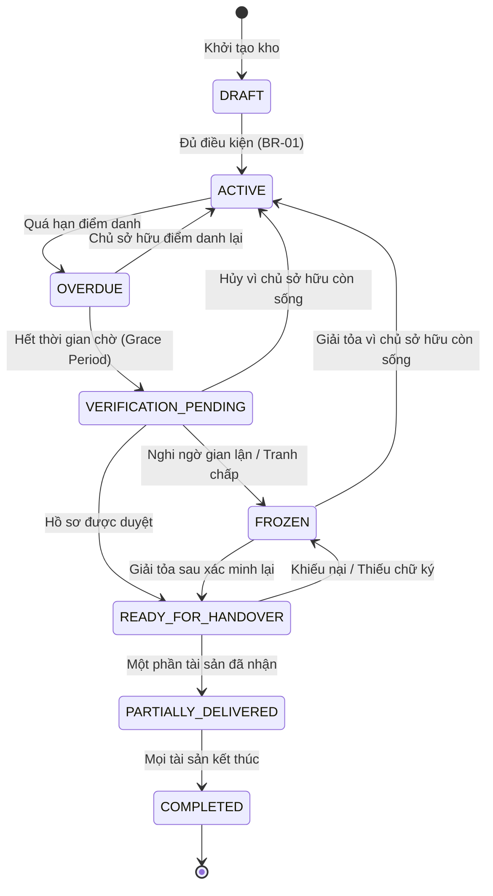

# TRƯỜNG ĐẠI HỌC FPT — KHOA KỸ THUẬT PHẦN MỀM
## MÔN HỌC: SWP391 (PHÁT TRIỂN ỨNG DỤNG DOANH NGHIỆP)

---

# TÀI LIỆU ĐẶC TẢ YÊU CẦU PHẦN MỀM LEGACYVAULT
### Phiên bản 1.1 — Cập nhật ngày 19/09/2026
**Tên đề tài:** LegacyVault – Hệ thống lưu giữ tài sản số và bàn giao sau xác minh sự kiện  
*(Digital Asset Vault & Event-Verified Handover System)*

---

## MỤC ĐÍCH CỦA TÀI LIỆU
Tài liệu này mô tả hướng hoạt động của LegacyVault bằng ngôn ngữ nghiệp vụ, từ lúc người dùng tạo kho lưu trữ cho đến khi tài sản được bàn giao cho người thụ hưởng.

Tài liệu xác định phạm vi triển khai cho đồ án SWP kéo dài 9 tuần. Trường hợp mất tích chỉ được lưu hồ sơ và chờ bổ sung căn cứ, không tự tạo quyền bàn giao. Các quy tắc về chia lại, thời hạn, thay người xử lý, cứu hộ và nhận tài sản được tích hợp trực tiếp vào từng luồng. Hệ thống chỉ hỗ trợ lưu giữ, xác minh và bàn giao tài sản số. Hệ thống không thay thế di chúc hợp pháp, công chứng viên, cơ quan hộ tịch, Tòa án hoặc chuyên gia pháp lý.

---

## 1. NGUỒN XÂY DỰNG TÀI LIỆU

### 1.1. Các tài liệu nội bộ

| Ký hiệu | Tài liệu | Nội dung được sử dụng |
| :--- | :--- | :--- |
| **GV** | `LegacyVault (3).docx` | Nguồn yêu cầu chính gồm 5 vai trò, 11 flow, tình huống thông thường và tình huống giả mạo |
| **D** | `srs- duong.md` | Nền tảng về việc không thông báo sớm cho người thụ hưởng, chia tài sản theo từng người nhận, cơ chế điểm danh và giới hạn quyền quản trị viên |
| **LT** | `SRS - Phương Án 1 (Legal-Tech) - LegacyVault.md` | Bố cục tài liệu và các nhánh mất tích, bổ sung hồ sơ, nghi ngờ gian lận và chủ sở hữu quay lại |

> **Quy định đối chiếu:**  
> Trong trường hợp các tài liệu có cách xử lý khác nhau, tài liệu của giáo viên được xem là yêu cầu đầu vào chính. Bản của Dương được dùng làm nền cho mô hình bàn giao. Bản Legal-Tech được dùng để bổ sung những tình huống còn thiếu.  
> Các quy tắc nghiệp vụ của bản 1.1 được cập nhật ngày 19/09/2026 theo nội dung đã thống nhất khi rà soát requirement. Trong phạm vi phiên bản này, nội dung quy định tại các mục 4 và 6 là cơ sở triển khai; các khác biệt với tài liệu đầu vào được ghi nhận tại mục 1.3.

### 1.2. Nguồn pháp luật tham khảo
Tài liệu tham khảo các văn bản chính thức sau để xác định giới hạn của sản phẩm:
1. **Bộ luật Dân sự 2015**.
2. **Luật Giao dịch điện tử 2023**.
3. **Luật Công chứng 2024**.
4. **Luật Bảo vệ dữ liệu cá nhân 2025**, có hiệu lực từ ngày 01/01/2026.

*Lưu ý:* Những nguồn này chỉ giúp nhóm xác định ranh giới nghiệp vụ. Nhóm vẫn cần người có chuyên môn pháp lý xem lại nếu muốn phát triển sản phẩm để sử dụng ngoài thực tế.

### 1.3. Các thay đổi được tích hợp trong phiên bản 1.1
- **Chia lại tài sản (`SHR`):** Mỗi tệp có một người nhận ban đầu; chỉ được chia lại một lần khi chủ sở hữu cho phép. Tỷ lệ ghi nhận bảng phân bổ quyền cùng nhận, không phân chia nội dung tệp.
- **Phân định thời hạn chuẩn (`TIME`):** Tách thời hạn quyết định, ký chung, hiệu lực liên kết, phiên tải, hoàn tất nhận và xử lý sự cố. Bảy ngày được xác định bằng 168 giờ; các thời hạn là chính sách sản phẩm của đồ án, không phải thời hạn pháp luật.
- **Phân công & Thay thế (`ASSIGN`):** Thay người thực hiện bằng danh sách dự phòng do chủ sở hữu chỉ định; thay người xác minh độc lập bằng danh sách đã được phê chuẩn. Không chọn một tài khoản bất kỳ để thay người thực hiện.
- **Kết thúc hồ sơ (`CLOSE`):** Đóng băng là trạng thái chưa kết thúc. Chủ sở hữu được xác nhận còn sống thì hủy hồ sơ sự kiện trước khi trở lại quản lý kho.
- **Cứu hộ (`RESCUE`):** Chủ sở hữu quay lại / báo còn sống chặn phát hành mới ngay lập tức; bảo toàn lịch sử dữ liệu đã phát hành trước đó.
- **Bảo mật & Mã hóa (`SEC`):** Mã hóa từng phiên bản tệp, bảo vệ khóa và kiểm soát phát hành qua dịch vụ được tin cậy. Phiên bản đồ án không cam kết máy chủ hoàn toàn không thể giải mã; đây là khác biệt với mô tả mã hóa đầu cuối trong tài liệu đầu vào.
- **Bàn giao dữ liệu (`DEL`):** Một giao dịch bàn giao cho phép tiếp tục sau mất kết nối; ghi riêng việc phát hành và xác nhận nhận.

> **Hệ thống mã yêu cầu truy vết:**  
> - `SHR`: Quy tắc chia lại tài sản  
> - `TIME`: Quy tắc thời hạn và đếm giờ  
> - `ASSIGN`: Quy tắc phân công và thay thế người xử lý  
> - `CLOSE`: Quy tắc điều kiện kết thúc và đóng hồ sơ  
> - `RESCUE`: Quy tắc cứu hộ khi chủ sở hữu quay lại  
> - `SEC`: Quy tắc bảo mật và quản lý khóa  
> - `DEL`: Quy tắc bàn giao và xác nhận nhận  
> Các mã này xác định những quy tắc được bổ sung hoặc sửa trong bản 1.1; những yêu cầu nghiệp vụ khác trong tài liệu vẫn có hiệu lực.

---

## 2. TỔNG QUAN VỀ HỆ THỐNG

### 2.1. Bài toán cần giải quyết
Một người có thể sở hữu nhiều tài sản số như tài liệu, hình ảnh, thông tin tài khoản, hợp đồng, hướng dẫn xử lý tài sản hoặc các tệp quan trọng khác. Khi người đó qua đời hoặc mất tích, người thân thường gặp ba vấn đề:
1. Không biết các tài sản số đang được lưu ở đâu.
2. Không biết ai là người được nhận từng tài sản.
3. Không có cách an toàn để xác minh sự kiện và bàn giao tài sản.

LegacyVault được xây dựng để giải quyết ba vấn đề trên. Chủ sở hữu có thể lưu tài sản vào một kho bảo mật, chỉ định người nhận cho từng tài sản và chọn một người thực hiện việc nộp hồ sơ khi có sự kiện xảy ra.

### 2.2. Hướng xây dựng được lựa chọn
Hệ thống hoạt động theo 7 nguyên tắc cốt lõi:
1. **Bảo mật thông tin chỉ định ban đầu:** Người thụ hưởng không cần biết mình đã được chỉ định khi kho được tạo.
2. **Quản lý phiên bản & Đồng thuận chia sẻ:** Mỗi phiên bản tệp được bảo vệ riêng và có một người nhận ban đầu. Khi chủ sở hữu cho phép chia lại, người nhận được lập một bảng chia duy nhất. Mọi người có tỷ lệ dương phải ký trước khi bất kỳ ai được mở toàn bộ tệp; tỷ lệ không giới hạn phần nội dung được đọc.
3. **Ý nghĩa của điểm danh:** Việc chủ sở hữu không điểm danh chỉ là dấu hiệu cần kiểm tra, không phải bằng chứng người đó đã qua đời.
4. **Thẩm quyền xác minh độc lập:** Chỉ người xác minh pháp lý đang được phân công và còn đủ điều kiện trong hệ thống mới được chấp thuận, từ chối hoặc xác nhận lại hồ sơ. Người thay thế phải được phân công và ghi lịch sử trước khi xử lý.
5. **Giới hạn quyền Quản trị viên:** Quản trị viên chỉ vận hành hệ thống, không được đọc tài sản và không được quyết định việc bàn giao.
6. **Không tự suy đoán mất tích thành qua đời:** Trường hợp mất tích phải được giữ riêng để chờ thêm căn cứ, không tự động coi là qua đời.
7. **Bảo toàn dữ liệu khi có biến cố:** Khi có dấu hiệu giả mạo hoặc khi chủ sở hữu quay lại, hệ thống phải dừng các lần bàn giao mới ngay lập tức và bảo toàn lịch sử những lần đã phát hành dữ liệu.

### 2.3. Mục tiêu trong 9 tuần
Phiên bản đồ án cần chứng minh được các chức năng cốt lõi sau:
- Tạo tài khoản và phân quyền đúng vai trò.
- Tạo kho lưu trữ và thêm tài sản số.
- Chỉ định người thụ hưởng cho từng tài sản.
- Chỉ định hoặc thu hồi người thực hiện hồ sơ.
- Nhắc chủ sở hữu điểm danh định kỳ.
- Mở hồ sơ xác minh khi chủ sở hữu không phản hồi.
- Xử lý được trường hợp qua đời, mất tích, thiếu giấy tờ và nghi ngờ gian lận.
- Bàn giao đúng tài sản cho đúng người sau khi hồ sơ được chấp thuận; hỗ trợ chia lại với tổng tỷ lệ 100% và yêu cầu tất cả người cùng truy cập một tệp ký đồng ý.
- Ghi lại lịch sử các hành động quan trọng.

*Phạm vi mô phỏng:* Những dịch vụ bên ngoài như xác minh căn cước điện tử, chữ ký số thật, SMS trả phí hoặc kết nối cơ quan công chứng chỉ nên được mô phỏng trong phạm vi đồ án.

---

## 3. CÁC VAI TRÒ TRONG HỆ THỐNG

### 3.1. Chủ sở hữu kho (Vault Owner)
Chủ sở hữu là người tạo và quản lý kho tài sản số. Người này có thể:
- Thêm, sửa hoặc xóa tài sản khi chưa có quá trình bàn giao.
- Chỉ định người thụ hưởng cho từng tài sản.
- Chỉ định, thu hồi và thay thế người thực hiện chính; chỉ định danh sách dự phòng theo thứ tự khi còn hoạt động.
- Chọn cho phép hoặc không cho phép chia lại đối với từng tệp.
- Bổ sung người thụ hưởng cho tài sản chưa được kê khai trong một tháng sau khi kích hoạt kho.
- Cài đặt chu kỳ điểm danh và thời gian chờ.
- Điểm danh để xác nhận mình vẫn đang hoạt động.
- Báo cho hệ thống biết nếu có yêu cầu giả mạo (`⚡ Tôi còn sống`).

### 3.2. Người thực hiện hồ sơ (Digital Executor)
Người thực hiện hồ sơ là người chính hoặc người dự phòng được chủ sở hữu chỉ định trước, đã xác minh và chấp nhận vai trò. Chỉ người đang được phân công mới được xử lý hồ sơ. Vai trò này có thể:
- Nhận thông báo khi chủ sở hữu đã quá thời gian điểm danh và thời gian chờ.
- Tạo hồ sơ xác minh.
- Ký xác nhận bản cam kết về tính trung thực của tài liệu trước khi khai và tải giấy chứng tử.
- Tải lên giấy tờ chứng minh sự kiện.
- Bổ sung giấy tờ khi được yêu cầu.
- Theo dõi kết quả xử lý hồ sơ.

*Giới hạn quyền hạn:* Người thực hiện hồ sơ không được đọc tài sản trong kho, không được lấy khóa mở tài sản và không được tự chấp thuận việc bàn giao.

### 3.3. Người thụ hưởng (Beneficiary)
Người thụ hưởng là người được nhận một hoặc nhiều tài sản do chủ sở hữu chỉ định. Người này:
- Không được thông báo ngay khi chủ sở hữu tạo kho.
- Chỉ nhận lời mời sau khi hồ sơ đã được chấp thuận.
- Phải xác minh danh tính trước khi nhận tài sản.
- Chỉ được nhìn thấy tài sản được phân cho mình.
- Có quyền nhận hoặc từ chối tài sản. Người nhận ban đầu chỉ được chia lại một lần nếu chủ sở hữu đã cho phép; người được chia thêm không được tiếp tục chia.
- Phải ký đồng ý cùng các người được phân quyền khác trước khi một tệp dùng chung được mở.

### 3.4. Người xác minh pháp lý (Legal Verifier)
Người xác minh pháp lý kiểm tra hồ sơ do người thực hiện nộp. Vai trò này có thể:
- Yêu cầu bổ sung giấy tờ.
- Chấp thuận hoặc từ chối hồ sơ.
- Đưa hồ sơ mất tích vào trạng thái chờ.
- Đánh dấu hồ sơ có dấu hiệu gian lận.
- Xác nhận chủ sở hữu còn sống và hủy hồ sơ sự kiện đang mở, giữ nguyên lịch sử phần đã phát hành.
- Nhận phân công, kiểm tra lại hồ sơ khi thay người xác minh và quyết định tiếp tục theo điều kiện hiện hành.
- Kiểm tra lại giấy chứng tử bị nghi ngờ sau khi đã bàn giao một phần và ghi quyết định xác nhận lại hoặc tiếp tục đóng băng trong thời hạn xử lý.

*Nguyên tắc độc lập & mô phỏng:* Trong đồ án, đây là một vai trò nghiệp vụ mô phỏng. Vai trò này không được giới thiệu như một công chứng viên hoặc cơ quan nhà nước thật. Người thực hiện và người xác minh phải khác nhau, không đồng thời là chủ sở hữu hoặc người thụ hưởng của cùng hồ sơ.

### 3.5. Quản trị viên hệ thống (System Admin)
Quản trị viên chịu trách nhiệm vận hành hệ thống. Quản trị viên có thể quản lý tài khoản, cấu hình thời gian mặc định, theo dõi lỗi, khóa tài khoản đáng ngờ và hỗ trợ xử lý sự cố.  
*Giới hạn quyền hạn:* Quản trị viên không được đọc nội dung tài sản, lấy khóa mở tài sản, thay đổi người thụ hưởng hoặc chấp thuận hồ sơ thay cho người xác minh.

---

## 4. PHẠM VI CỦA PHIÊN BẢN ĐỒ ÁN

### 4.1. Chức năng nằm trong phạm vi
- Đăng ký, đăng nhập và xác thực nhiều bước (MFA).
- Phân quyền cho năm vai trò rõ ràng.
- Tạo kho và quản lý tài sản số.
- Bảo vệ riêng từng tài sản.
- Chỉ định người thụ hưởng và người thực hiện hồ sơ.
- Điểm danh định kỳ và gửi nhắc nhở.
- Tạo, bổ sung, chấp thuận hoặc từ chối hồ sơ.
- Xử lý trường hợp mất tích và nghi ngờ gian lận.
- Gửi lời mời cho người thụ hưởng sau khi được chấp thuận.
- Bàn giao riêng từng tài sản; chia lại một lần và thu đủ chữ ký.
- Theo dõi riêng thời hạn quyết định, ký chung, nhận tài sản.
- Phân công người dự phòng; cứu hộ khi chủ sở hữu quay lại.
- Ghi lịch sử hoạt động và xử lý sự cố.

### 4.2. Chức năng nằm ngoài phạm vi
- Tự động tuyên bố một người đã qua đời.
- Thay thế công chứng, đăng ký hộ tịch hoặc quyết định của Tòa án.
- Tự động phân chia tài sản theo pháp luật thừa kế.
- Chuyển quyền sở hữu bất động sản hoặc tài sản phải đăng ký.
- Tích hợp thật với dịch vụ căn cước, chữ ký số hoặc cơ quan nhà nước.
- Cam kết mã hóa đầu cuối khiến máy chủ hoàn toàn không có khả năng giải mã.

### 4.3. Các trạng thái nghiệp vụ chuẩn xác

#### Trạng thái của kho (Vault Status)
- `Bản nháp (DRAFT)`: Đang thiết lập cấu hình và tài sản.
- `Đang hoạt động (ACTIVE)`: Hoạt động bình thường, lắng nghe điểm danh.
- `Trễ điểm danh (OVERDUE)`: Quá hạn điểm danh nhưng trong thời gian chờ (Grace Period).
- `Chờ xác minh (VERIFICATION_PENDING)`: Hết thời gian chờ, cần kiểm tra hồ sơ sự kiện.
- `Sẵn sàng bàn giao (READY_FOR_HANDOVER)`: Hồ sơ xác minh đã được chấp thuận.
- `Đang bàn giao một phần (PARTIALLY_DELIVERED)`: Một số tài sản đã được nhận thành công.
- `Đã hoàn tất (COMPLETED)`: Mọi tài sản đã kết thúc xử lý.
- `Đóng băng (FROZEN)`: Tạm dừng do tranh chấp, nghi ngờ gian lận hoặc thiếu chữ ký đồng thuận.

#### Trạng thái của hồ sơ xác minh (Verification Case Status)
- `Mới nộp (SUBMITTED)`
- `Đang xem xét (UNDER_REVIEW)`
- `Cần bổ sung (NEEDS_EVIDENCE)`
- `Chờ mất tích (MISSING_PENDING)`
- `Đã chấp thuận (APPROVED)`
- `Đã từ chối (REJECTED)`
- `Gian lận (FRAUDULENT)`
- `Tạm dừng (PAUSED)`
- `Đã xác nhận lại (RE_VERIFIED)`
- `Đã hủy (CANCELLED)`
- `Đã đóng hồ sơ (CLOSED)`

### 4.4. Điều kiện kết thúc và đóng hồ sơ
- **`CLOSE-01`**: Trạng thái đóng băng là trạng thái chưa kết thúc.
- **`CLOSE-02`**: Hoàn tất xác minh không đồng nghĩa đã hoàn tất bàn giao.
- **`CLOSE-03`**: Tài sản chỉ kết thúc khi mọi người nhận đã xác nhận hoặc bản lưu đã xóa hợp lệ.
- **`CLOSE-04`**: Chỉ đóng toàn bộ quá trình khi mọi tài sản đã kết thúc.
- **`CLOSE-05`**: Với chủ sở hữu còn sống, kết thúc theo lý do *"Đã hủy vì chủ sở hữu còn sống"*.

---

## 5. MỐI LIÊN HỆ GIỮA CÁC FLOW

| Flow giáo viên | Mức độ | Được xử lý tại |
| :--- | :--- | :--- |
| **Flow 1 – Tài khoản, vai trò** | Bắt buộc | Luồng chính 1 và 5 |
| **Flow 2 – Tạo kho, mã hóa** | Bắt buộc | Luồng chính 1 |
| **Flow 3 – Thụ hưởng & Người thực hiện** | Bắt buộc | Luồng chính 1 |
| **Flow 4 – Điểm danh & Chờ xác minh** | Bắt buộc | Luồng chính 2 |
| **Flow 5 – Nộp, duyệt hồ sơ** | Bắt buộc | Luồng chính 3 |
| **Flow 6 – Thông báo & Bàn giao** | Bắt buộc | Luồng chính 4 |
| **Flow 7 – Lịch sử & Cảnh báo** | Tùy chọn | Luồng chính 2 và 5 |
| **Flow 8 – Tiến độ & Đóng hồ sơ** | Tùy chọn | Luồng chính 4 |
| **Flow 9 – Trao đổi & Chữ ký** | Tùy chọn | Luồng chính 3 |
| **Flow 10 – Chính sách & Bảo mật** | Tùy chọn | Luồng chính 5 |
| **Flow 11 – Kết nối dịch vụ** | Tùy chọn | Luồng chính 5 |

---

## 6. CÁC LUỒNG NGHIỆP VỤ CHÍNH

### 6.1. Luồng chính 1 – Tạo tài khoản, tạo kho và thiết lập người nhận
Chủ sở hữu tạo kho, thêm tài sản và chỉ định người thụ hưởng. Mỗi phiên bản tệp được mã hóa bằng khóa dữ liệu riêng.
- **`SEC-01`**: Mỗi phiên bản tệp dùng một khóa dữ liệu ngẫu nhiên riêng (AES-256-GCM).
- **`SEC-05`**: Vai trò Admin, Executor và Verifier không có quyền tải nội dung hoặc lấy khóa qua vai trò đó.
- **Quy tắc thời hạn bổ sung:** Tài sản chưa có người nhận có một tháng để bổ sung; quá hạn sẽ bị đóng băng riêng tài sản đó.

### 6.2. Luồng chính 2 – Điểm danh định kỳ
Hệ thống gửi nhắc nhở định kỳ. Nếu không phản hồi sau thời gian chờ, kho chuyển sang trạng thái "Chờ xác minh".
- Không điểm danh không có nghĩa là đã qua đời.
- Người thực hiện chỉ được thông báo cần kiểm tra, không được thông báo kết luận chết/mất tích.

### 6.3. Luồng chính 3 – Nộp và xác minh hồ sơ
Người thực hiện nộp giấy chứng tử/giấy tờ liên quan. Người xác minh kiểm tra tính hợp lệ.
- **`ASSIGN-06`**: Người thực hiện và người xác minh phải là hai tài khoản khác nhau.
- **`RESCUE-01`**: Chủ sở hữu báo "Tôi còn sống" sẽ chặn phát hành mới ngay lập tức để kiểm tra lại hồ sơ.
- **Phản ứng gian lận:** Nếu nghi ngờ gian lận, hệ thống đóng băng toàn bộ phần chưa bàn giao ngay lập tức.

### 6.4. Luồng chính 4 – Thông báo và bàn giao tài sản
Gửi lời mời cho người thụ hưởng sau khi hồ sơ được duyệt.
- **`SHR-05`**: Không cấp khóa cho bất kỳ người nào trước khi đủ chữ ký của mọi người có tỷ lệ dương trên bảng chia.
- **`TIME-01`**: Bảy ngày được tính là 168 giờ liên tục.

#### Bảng quy chuẩn thời hạn các giai đoạn:
| Giai đoạn | Thời hạn | Hành động khi hết hạn |
| :--- | :--- | :--- |
| **Quyết định nhận** | 168 giờ | Xét điều kiện xóa theo quy định |
| **Ký bảng chia** | 168 giờ | Không ai được mở; xét xóa |
| **Phiên nhận khóa** | 15 phút | Phiên hết hiệu lực; người nhận phải xác thực lại |
| **Xác minh lại** | 168 giờ | Tiếp tục tạm dừng / đóng băng |

### 6.5. Luồng chính 5 – Quản trị và Lịch sử
Quản trị viên vận hành hệ thống nhưng không có quyền can thiệp vào nội dung tài sản. Audit Log ghi lại mọi thay đổi trạng thái, chữ ký và quyết định của người xác minh mà không chứa bất kỳ khóa bí mật nào.

---

## 7. TÓM TẮT MÔ HÌNH NGHIỆP VỤ
1. Chủ sở hữu mã hóa tài sản, chỉ định người nhận và người thực hiện.
2. Điểm danh để duy trì trạng thái hoạt động.
3. Người thực hiện nộp hồ sơ khi có sự kiện; Người xác minh độc lập phê duyệt.
4. Bàn giao dựa trên chữ ký đồng thuận nếu có chia lại.
5. Giao dịch bàn giao có thể tiếp tục sau mất kết nối nếu kiểm tra lại điều kiện an toàn.
6. Kết thúc quá trình khi mọi tài sản đã được xử lý xong.

---

## 8. CÁC QUYẾT ĐỊNH NGHIỆP VỤ BẮT BUỘC (BUSINESS RULES)

### 8.1. Điều kiện kích hoạt kho
- **`BR-01`**: Kho chỉ được chuyển từ Bản nháp sang Đang hoạt động khi chủ sở hữu đã xác minh tài khoản, đã thiết lập MFA, có ít nhất một tài sản và có ít nhất một Người thực hiện hồ sơ đã xác minh tài khoản, chấp nhận vai trò.
- **`BR-02`**: Nếu chưa có Người thực hiện hồ sơ sẵn sàng, hệ thống giữ kho ở trạng thái Bản nháp và hiển thị phần thiết lập còn thiếu.
- **`BR-03`**: Tài sản chưa có người nhận không chặn kích hoạt kho, nhưng phải áp dụng thời hạn bổ sung một tháng và chỉ đóng băng riêng tài sản đó khi hết hạn.

### 8.2. Tiêu chí Người thụ hưởng hợp lệ
- **`BR-04`**: Người thụ hưởng hợp lệ phải có thông tin liên hệ không trùng lặp, không bị khóa tài khoản tại thời điểm hành động và hoàn tất xác minh danh tính trước khi nhận tài sản.
- **`BR-05`**: Người thực hiện hoặc Người xác minh của cùng hồ sơ không được đồng thời là Người thụ hưởng trong hồ sơ đó.
- **`BR-06`**: Khi chia lại, người nhận ban đầu chỉ được chọn người trong danh sách Người thụ hưởng đã được chủ sở hữu khai báo trước. Người được chia thêm không được chia tiếp.
- **`BR-07`**: Người có tỷ lệ bằng 0 không có quyền nhận và không phải ký; tổng tỷ lệ của những người trong bảng chia phải đúng 100%.

### 8.3. Khóa chỉnh sửa và quản lý phiên bản
- **`BR-08`**: Khi hồ sơ chuyển sang Đang xem xét, các phiên bản tài sản thuộc phạm vi hồ sơ bị khóa chỉnh sửa.
- **`BR-09`**: Chủ sở hữu chỉ được sửa tài sản sau khi hồ sơ bị hủy hợp lệ. Mọi thay đổi phải tạo phiên bản tài sản mới; quyết định, chữ ký và quyền nhận của phiên bản cũ không tự áp dụng cho phiên bản mới.
- **`BR-10`**: Mỗi quyết định xác minh và giao dịch bàn giao phải tham chiếu đúng mã hồ sơ, mã tài sản, phiên bản tài sản và phiên bản bảng chia.

### 8.4. Thẩm quyền kết thúc không bàn giao và xóa bản lưu
- **`BR-11`**: Người xác minh đang được phân công là vai trò ra quyết định kết thúc không bàn giao hoặc cho phép xét xóa bản lưu. Quản trị viên không có quyền ra quyết định nghiệp vụ này.
- **`BR-12`**: Hệ thống chỉ thực hiện xóa khi quyết định còn hiệu lực, không có sự cố hoặc khiếu nại đang mở, chưa phát hành khóa hoặc dữ liệu của phiên bản cần xóa và đã ghi đầy đủ lý do, người quyết định, phiên bản và thời điểm.
- **`BR-13`**: Bản dữ liệu hoặc khóa đã ra khỏi hệ thống không được mô tả là đã thu hồi hoặc đã xóa khỏi thiết bị người nhận.

### 8.5. Lỗi gửi lời mời
- **`BR-14`**: Hệ thống thử gửi lại sau 15 phút, 1 giờ, 6 giờ, 24 giờ và 48 giờ; theo dõi tối đa 72 giờ cho mỗi đợt mời.
- **`BR-15`**: Đồng hồ quyết định hoặc ký chỉ bắt đầu khi hệ thống nhận xác nhận giao thành công. Callback trùng không thay đổi mốc thời gian.
- **`BR-16`**: Sau 72 giờ chưa giao thành công, giao dịch chuyển sang Chờ hỗ trợ. Lỗi gửi không được coi là từ chối, không tự làm phát sinh quyền xóa và không được đặt lại toàn bộ quy trình.
- **`BR-17`**: Cập nhật thông tin liên hệ phải được kiểm soát quyền, ghi lịch sử và không làm thay đổi người nhận đã được chủ sở hữu chỉ định.

---

## 9. MA TRẬN PHÂN QUYỀN

- **Chủ sở hữu (Owner):** Quản lý kho và tài sản khi chưa bị khóa chỉnh sửa; chỉ định Người thụ hưởng và Người thực hiện; cấu hình điểm danh; báo còn sống hoặc báo giả mạo.
- **Người thực hiện hồ sơ (Executor):** Tạo, bổ sung và theo dõi hồ sơ khi đang được phân công; không đọc tài sản, lấy khóa hoặc phê duyệt hồ sơ.
- **Người thụ hưởng (Beneficiary):** Xem và nhận đúng tài sản được phân; lập bảng chia khi được phép; ký hoặc từ chối; không xem tài sản của người khác.
- **Người xác minh (Verifier):** Xem giấy tờ trong hồ sơ được phân công; yêu cầu bổ sung; chấp thuận, từ chối, xác nhận lại, kết thúc không bàn giao hoặc cho phép xét xóa theo quy tắc; không đọc nội dung tài sản.
- **Quản trị viên (Admin):** Quản lý tài khoản, cấu hình mặc định, lỗi dịch vụ, sự cố và báo cáo đã giảm thiểu dữ liệu; không đọc tài sản, lấy khóa, đổi người nhận hoặc quyết định bàn giao.

---

## 10. MÔ HÌNH TRẠNG THÁI

### 10.1. Trạng thái kho

- Đóng băng là trạng thái tạm dừng có thể phát sinh từ `Chờ xác minh`, `Sẵn sàng bàn giao` hoặc `Đang bàn giao một phần`; không phải trạng thái kết thúc.
- Kho chỉ chuyển sang `Đã hoàn tất` khi mọi tài sản thuộc phạm vi có kết quả cuối cùng và không còn sự cố mở.

### 10.2. Trạng thái hồ sơ
- `Mới nộp` $\rightarrow$ `Đang xem xét` $\leftrightarrow$ `Cần bổ sung`.
- `Đang xem xét` $\rightarrow$ `Đã chấp thuận` hoặc `Đã từ chối`.
- Hồ sơ mất tích chuyển sang `Chờ mất tích` và **không tạo quyền bàn giao**.
- Khi nghi ngờ gian lận, hồ sơ chuyển `Tạm dừng` hoặc `Gian lận`; phần chưa phát hành bị chặn ngay lập tức.
- Khi chủ sở hữu được xác nhận còn sống, hồ sơ chuyển `Đã hủy vì chủ sở hữu còn sống`.

### 10.3. Trạng thái tài sản và giao dịch
- `Đang khóa` $\rightarrow$ `Đủ điều kiện bàn giao` $\rightarrow$ `Chờ quyết định hoặc chữ ký` $\rightarrow$ `Đã cấp phiên nhận` $\rightarrow$ `Có thể đã phát hành, chưa xác nhận` $\rightarrow$ `Đã phát hành, chờ xác nhận` $\rightarrow$ `Đã nhận thành công`.
- Các kết quả cuối khác gồm `Đã xóa hợp lệ` và `Kết thúc không bàn giao`.
- Mất kết nối không tạo giao dịch thứ hai; người nhận xác thực lại và tiếp tục cùng giao dịch logic.

---

## 11. MÔ HÌNH DỮ LIỆU TỐI THIỂU (16 THỰC THỂ CHUẨN)

1. **`User`**: Tài khoản và trạng thái xác thực.
2. **`RoleAssignment`**: Vai trò theo kho hoặc hồ sơ; không dùng một vai trò toàn cục duy nhất.
3. **`Vault`**: Kho, chủ sở hữu, trạng thái và cấu hình điểm danh.
4. **`Asset`**: Thông tin logic của tài sản.
5. **`AssetVersion`**: Phiên bản, vị trí bản mã, kiểm tra toàn vẹn và khóa dữ liệu đã bao bọc (Wrapped Data Key).
6. **`BeneficiaryDesignation`**: Người nhận ban đầu do chủ sở hữu chỉ định cho từng tài sản.
7. **`ExecutorAssignment`**: Người thực hiện chính, danh sách dự phòng, trạng thái chấp nhận và lịch sử phân công.
8. **`VerificationCase`**: Loại sự kiện, trạng thái, người đang được phân công và phiên bản bằng chứng.
9. **`EvidenceVersion`**: Giấy tờ và bản bổ sung bất biến theo phiên bản.
10. **`VerificationDecision`**: Quyết định, phạm vi tài sản và các phiên bản được phép bàn giao.
11. **`RedistributionTable`**: Bảng chia duy nhất của một phiên bản tài sản.
12. **`RedistributionMember`**: Người tham gia, tỷ lệ và trạng thái chữ ký.
13. **`ConsentSignature`**: Người ký, phiên bản bảng chia và thời điểm.
14. **`DeliveryTransaction`**: Giao dịch logic theo hồ sơ, phiên bản tài sản và người nhận.
15. **`DeliveryAttempt`**: Cấp phiên, ý định phát hành, kết quả phát hành và xác nhận nhận.
16. **`Incident`**: Sự cố, đối tượng bị ảnh hưởng, trạng thái tạm dừng và kết luận.
17. **`AuditLog`**: Chủ thể, hành động, đối tượng, phiên bản, kết quả, lý do và thời điểm; không chứa bí mật.

---

## 12. YÊU CẦU PHI CHỨC NĂNG (NON-FUNCTIONAL REQUIREMENTS)

- **`NFR-01`**: 95% API thông thường phản hồi trong không quá 2 giây, không tính thời gian tải tệp và dịch vụ bên ngoài.
- **`NFR-02`**: Phiên bản đồ án hỗ trợ tệp tối đa 50 MB; giới hạn phải được kiểm tra trước khi tải lên.
- **`NFR-03`**: Dữ liệu truyền qua HTTPS; mỗi phiên bản tệp dùng AES-256-GCM và khóa dữ liệu riêng.
- **`NFR-04`**: MFA hoặc xác thực lại bắt buộc trước thao tác phê duyệt, ký, phát hành hoặc nhận tài sản.
- **`NFR-05`**: Phiên nhận có hiệu lực 15 phút. Request lặp hoặc callback trùng phải trả kết quả cũ và không tạo lần phát hành mới.
- **`NFR-06`**: Mật khẩu, OTP, khóa rõ và nội dung tài sản không được ghi vào log.
- **`NFR-07`**: Hệ thống lưu thời điểm theo UTC và hiển thị theo múi giờ Asia/Ho_Chi_Minh.
- **`NFR-08`**: Thực hiện sao lưu dữ liệu đã bảo vệ tối thiểu mỗi ngày. Mục tiêu RPO là 24 giờ và RTO là 4 giờ cho phạm vi đồ án.
- **`NFR-09`**: Khôi phục không được làm sống lại quyền đã thu hồi, lời mời hết hạn, quyết định đã hủy hoặc dữ liệu đã xóa.
- **`NFR-10`**: Các dịch vụ eKYC, chữ ký số, SMS và kết nối cơ quan bên ngoài được mô phỏng; lỗi dịch vụ phải dừng an toàn tại bước phụ thuộc.
- **`NFR-11`**: Tài liệu định danh và giấy tờ xác minh phải được phân quyền tách biệt với nội dung tài sản.
- **`NFR-12`**: Mọi hành động trọng yếu phải có Audit Log đủ thông tin để truy vết và sinh testcase.

---

## 13. MA TRẬN TRUY VẾT VÀ TIÊU CHÍ NGHIỆM THU

- **Luồng 6.1 (Khởi tạo kho & tài sản):** `BR-01` đến `BR-10`, `SEC-01` đến `SEC-09`. Nghiệm thu khi kho chỉ kích hoạt đúng điều kiện, tài sản được phiên bản hóa và quyền của các vai trò bị giới hạn đúng.
- **Luồng 6.2 (Điểm danh sinh tồn):** `TIME` và `RESCUE`. Nghiệm thu khi không phản hồi chỉ chuyển trạng thái kiểm tra, không tạo quyền nhận và không gửi trùng cảnh báo.
- **Luồng 6.3 (Nộp & thẩm định hồ sơ):** `ASSIGN`, `RESCUE`, `CLOSE` và `BR-11` đến `BR-13`. Nghiệm thu khi chỉ người được phân công quyết định hồ sơ, nhánh mất tích không bàn giao và chủ sở hữu quay lại chặn phát hành ngay.
- **Luồng 6.4 (Phân phối & bàn giao):** `SHR`, `TIME`, `DEL` và `BR-14` đến `BR-17`. Nghiệm thu khi đủ chữ ký mới phát hành, thời hạn bắt đầu đúng sự kiện giao thành công và mất kết nối không tạo giao dịch mới.
- **Luồng 6.5 (Quản trị & Kiểm toán):** `SEC`, `NFR` và `AuditLog`. Nghiệm thu khi Admin không đọc tài sản hoặc quyết định nghiệp vụ, log không chứa bí mật và khôi phục không làm quyền cũ hoạt động lại.

---

## 14. ĐỊNH HƯỚNG SAU MVP (POST-MVP ROADMAP)

Các nội dung sau **không thuộc baseline 9 tuần của đồ án SWP391** và chỉ được xem xét sau khi hoàn thành MVP, có threat model, kế hoạch kiểm thử và tư vấn pháp lý phù hợp:
1. Thuật toán phân mảnh bí mật **Shamir Secret Sharing (2/3)**.
2. **Master Key** cấp toàn kho.
3. Cơ chế **Zero-Knowledge tuyệt đối** (máy chủ hoàn toàn không thể giải mã).
4. Tích hợp cổng dịch vụ **Công chứng viên thật (Real Notary)**.
5. Thiết bị bảo mật phần cứng **HSM**.
6. Lưu trữ bất biến **WORM** / Chuẩn đóng dấu thời gian **RFC 3161**.
7. Lưu trữ sổ cái phân tán **Blockchain**.
8. Cây gia đình hạt nhân xác thực quan hệ nhân thân.
9. Phân cấp thụ hưởng **Tier 1 / Tier 2**.
10. Tiêu hủy mật mã tự động (**Cryptographic Burn**).
11. Sao lưu dự phòng đa vùng địa lý (**Geo-redundancy**).
12. Tích hợp thanh toán gói dịch vụ thực tế.
